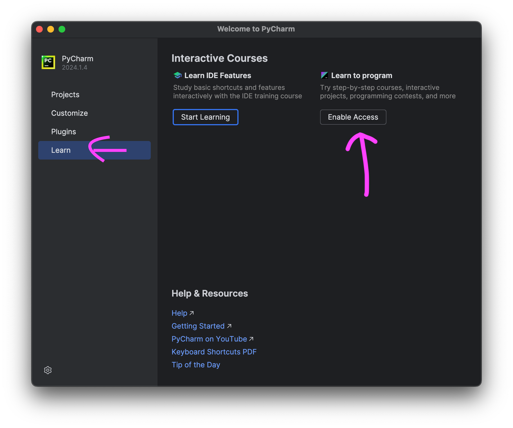

<h1>Step 1: Download and Install Python</h1>

Download the latest version of Python from the official website and complete the installation.

<a href="https://www.python.org/downloads/">Download Python</a>

<h1>Step 2: Download PyCharm Community Edition</h1>

Download the free Community Edition of PyCharm using the link below:

<a href="https://www.jetbrains.com/edu-products/download/#section=pycharm-edu">Download PyCharm Community Edition</a>

<h1>Step 3: Enable Access in PyCharm</h1>

Once PyCharm installs successfully, you should see the welcome screen. Click on the <strong>Learn</strong> tab and then click <strong>"Enable Access"</strong>.

